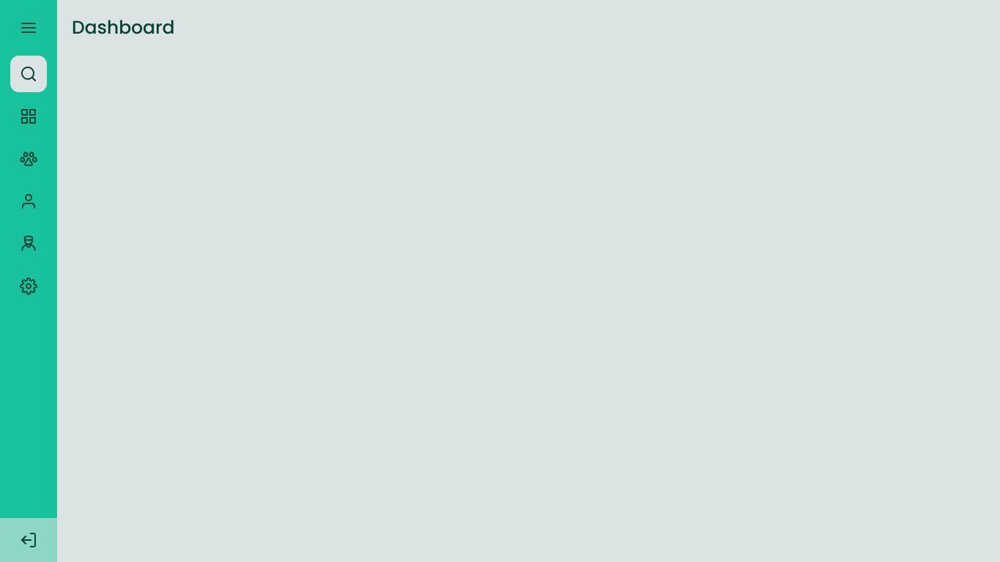

<h1 align="center">Responsive Sidebar Menu</h1>

    Desafio: Sidebar responsiva da equipe Rocketseat 💜

    <a href="#-tecnologias">Tecnologias</a>&nbsp;&nbsp;&nbsp;|&nbsp;&nbsp;&nbsp;
    <a href="#-projeto">Projeto</a>&nbsp;&nbsp;&nbsp;|&nbsp;&nbsp;&nbsp;
    <a href="#-layout">Layout</a>

 

    

    

## 🚀 Tecnologias

Esse projeto foi desenvolvido com as seguintes tecnologias:

- HTML
- CSS
- JavaScript

## 💻 Projeto

Neste desafio foi criado uma sidebar como na imagem acima. Quando o usuário clicar no ícone do menu isso deve fazer com que o estado da sidebar mude entre "aberto", mostrando ícones e texto e "fechado", mostrando apenas os ícones.

## 📋 Layout 

Voce pode visualizar o layout do projeto atraves [DESSE LINK](https://www.figma.com/file/iOuqAlZvhAMkkfjCMFyc7Y/DD-%2F-Sidebar-Responsiva/duplicate). E necessario ter conta no [Figma](https://figma.com) para acessa-lo.

---

Feito com 💜 by Phelipe Pereira :wave:
